# DFD Level 0 - Diagram Konteks

## Sistem Informasi Manajemen Gudang PT. Jaya Pratama Groserindo

### Deskripsi

Diagram konteks (DFD Level 0) menggambarkan sistem secara keseluruhan sebagai satu proses tunggal yang berinteraksi dengan entitas eksternal. Diagram ini menunjukkan batasan sistem dan aliran data antara sistem dengan pihak-pihak luar.

---

### Diagram Konteks

```mermaid
flowchart TB
    %% Styling
    classDef entity fill:#e1f5fe,stroke:#01579b,stroke-width:2px,color:#01579b
    classDef process fill:#fff3e0,stroke:#e65100,stroke-width:3px,color:#e65100,font-weight:bold

    %% External Entities
    ADMIN[/"👤 Admin/Direktur"/]
    PURCHASING[/"👤 Staf Purchasing"/]
    PENERIMAAN[/"👤 Staf Penerimaan"/]
    SUPERVISOR[/"👤 Supervisor"/]

    %% Central Process
    SISTEM(("⚙️ Sistem Informasi\nManajemen Gudang\nPT. Jaya Pratama\nGroserindo"))

    %% Data Flows from Admin/Direktur (Input)
    ADMIN -->|"Data Login"| SISTEM
    ADMIN -->|"Keputusan Approval PO"| SISTEM
    ADMIN -->|"Keputusan Approval Barang Masuk"| SISTEM
    ADMIN -->|"Keputusan Approval Barang Keluar"| SISTEM
    ADMIN -->|"Permintaan Laporan"| SISTEM

    %% Data Flows to Admin/Direktur (Output)
    SISTEM -->|"Info Dashboard"| ADMIN
    SISTEM -->|"Daftar PO Pending"| ADMIN
    SISTEM -->|"Daftar Barang Masuk Pending"| ADMIN
    SISTEM -->|"Daftar Barang Keluar Pending"| ADMIN
    SISTEM -->|"Notifikasi Approval"| ADMIN
    SISTEM -->|"Laporan Stok"| ADMIN
    SISTEM -->|"Laporan PO"| ADMIN
    SISTEM -->|"Laporan Penerimaan"| ADMIN
    SISTEM -->|"Laporan Barang Keluar"| ADMIN

    %% Data Flows from Staf Purchasing (Input)
    PURCHASING -->|"Data Login"| SISTEM
    PURCHASING -->|"Data Supplier Baru"| SISTEM
    PURCHASING -->|"Data Supplier Update"| SISTEM
    PURCHASING -->|"Data Purchase Order"| SISTEM
    PURCHASING -->|"Detail Barang PO"| SISTEM

    %% Data Flows to Staf Purchasing (Output)
    SISTEM -->|"Info Dashboard"| PURCHASING
    SISTEM -->|"Daftar Supplier"| PURCHASING
    SISTEM -->|"Daftar Barang"| PURCHASING
    SISTEM -->|"Daftar PO"| PURCHASING
    SISTEM -->|"Status Approval PO"| PURCHASING
    SISTEM -->|"Notifikasi PO Disetujui/Ditolak"| PURCHASING

    %% Data Flows from Staf Penerimaan (Input)
    PENERIMAAN -->|"Data Login"| SISTEM
    PENERIMAAN -->|"Data Penerimaan Barang"| SISTEM
    PENERIMAAN -->|"Data Barang Keluar"| SISTEM
    PENERIMAAN -->|"Detail Barang Masuk"| SISTEM
    PENERIMAAN -->|"Detail Barang Keluar"| SISTEM

    %% Data Flows to Staf Penerimaan (Output)
    SISTEM -->|"Info Dashboard"| PENERIMAAN
    SISTEM -->|"Daftar PO Siap Terima"| PENERIMAAN
    SISTEM -->|"Daftar Barang"| PENERIMAAN
    SISTEM -->|"Status Stok"| PENERIMAAN
    SISTEM -->|"Status Approval Barang Masuk"| PENERIMAAN
    SISTEM -->|"Status Approval Barang Keluar"| PENERIMAAN
    SISTEM -->|"Notifikasi Approval"| PENERIMAAN

    %% Data Flows from Supervisor (Input)
    SUPERVISOR -->|"Data Login"| SISTEM
    SUPERVISOR -->|"Data Pengguna Baru"| SISTEM
    SUPERVISOR -->|"Data Pengguna Update"| SISTEM
    SUPERVISOR -->|"Hapus Pengguna"| SISTEM

    %% Data Flows to Supervisor (Output)
    SISTEM -->|"Daftar Pengguna"| SUPERVISOR
    SISTEM -->|"Info Role Pengguna"| SUPERVISOR
    SISTEM -->|"Konfirmasi Aksi"| SUPERVISOR

    %% Apply Styles
    class ADMIN,PURCHASING,PENERIMAAN,SUPERVISOR entity
    class SISTEM process
```

---

### Penjelasan Entitas Eksternal

| No  | Entitas             | Deskripsi                           | Role dalam Sistem                                             |
| --- | ------------------- | ----------------------------------- | ------------------------------------------------------------- |
| 1   | **Admin/Direktur**  | Pengguna dengan hak akses tertinggi | Approval semua transaksi, akses laporan, monitoring dashboard |
| 2   | **Staf Purchasing** | Bagian pengadaan barang             | Membuat PO, mengelola data supplier                           |
| 3   | **Staf Penerimaan** | Bagian gudang/penerimaan            | Mencatat penerimaan barang, mencatat barang keluar            |
| 4   | **Supervisor**      | Pengelola sistem pengguna           | Mengelola data user dan hak akses                             |

---

### Penjelasan Aliran Data

#### 🔵 Admin/Direktur ↔ Sistem

| Arah | Aliran Data                      | Keterangan                                          |
| ---- | -------------------------------- | --------------------------------------------------- |
| →    | Data Login                       | Username dan password untuk autentikasi             |
| →    | Keputusan Approval PO            | Approve/Decline Purchase Order beserta catatan      |
| →    | Keputusan Approval Barang Masuk  | Approve/Decline penerimaan barang                   |
| →    | Keputusan Approval Barang Keluar | Approve/Decline pengeluaran barang                  |
| →    | Permintaan Laporan               | Request laporan stok, PO, penerimaan, barang keluar |
| ←    | Info Dashboard                   | KPI, statistik, grafik tren                         |
| ←    | Daftar Pending Approval          | PO, BM, BK yang menunggu persetujuan                |
| ←    | Notifikasi Approval              | Pemberitahuan transaksi baru yang perlu direview    |
| ←    | Laporan                          | Laporan stok, PO, penerimaan, barang keluar         |

#### 🟢 Staf Purchasing ↔ Sistem

| Arah | Aliran Data         | Keterangan                                        |
| ---- | ------------------- | ------------------------------------------------- |
| →    | Data Login          | Username dan password untuk autentikasi           |
| →    | Data Supplier       | Tambah/edit data supplier (nama, alamat, telepon) |
| →    | Data Purchase Order | Kode PO, tanggal, supplier, detail barang pesanan |
| ←    | Info Dashboard      | Ringkasan stok, PO bulan ini                      |
| ←    | Daftar Supplier     | List supplier yang tersedia                       |
| ←    | Daftar Barang       | List barang untuk dipilih saat buat PO            |
| ←    | Status Approval PO  | Status pending/approved/declined                  |
| ←    | Notifikasi          | Pemberitahuan PO disetujui/ditolak                |

#### 🟠 Staf Penerimaan ↔ Sistem

| Arah | Aliran Data            | Keterangan                                            |
| ---- | ---------------------- | ----------------------------------------------------- |
| →    | Data Login             | Username dan password untuk autentikasi               |
| →    | Data Penerimaan Barang | Tanggal terima, catatan, berdasarkan PO yang approved |
| →    | Data Barang Keluar     | Tanggal, catatan, detail barang yang dikeluarkan      |
| ←    | Info Dashboard         | Ringkasan stok, PO menunggu penerimaan                |
| ←    | Daftar PO Siap Terima  | PO yang sudah approved dan siap diproses              |
| ←    | Daftar Barang          | List barang dengan info stok                          |
| ←    | Status Approval        | Status barang masuk/keluar                            |
| ←    | Notifikasi             | Pemberitahuan approval dari direktur                  |

#### 🟣 Supervisor ↔ Sistem

| Arah | Aliran Data     | Keterangan                                              |
| ---- | --------------- | ------------------------------------------------------- |
| →    | Data Login      | Username dan password untuk autentikasi                 |
| →    | Data Pengguna   | Tambah/edit/hapus user (nama, username, password, role) |
| ←    | Daftar Pengguna | List semua user dengan role masing-masing               |
| ←    | Konfirmasi Aksi | Feedback sukses/gagal operasi CRUD                      |

---

### Batasan Sistem

Sistem Informasi Manajemen Gudang ini mencakup:

✅ **Dalam Lingkup Sistem:**

- Autentikasi pengguna multi-role
- Manajemen data barang (CRUD + gambar)
- Manajemen data supplier
- Pembuatan dan approval Purchase Order
- Pencatatan dan approval penerimaan barang
- Pencatatan dan approval barang keluar
- Update stok otomatis setelah approval
- Sistem notifikasi real-time
- Pelaporan (stok, PO, penerimaan, barang keluar)
- Manajemen pengguna

❌ **Di Luar Lingkup Sistem:**

- Sistem keuangan/pembayaran
- Integrasi dengan sistem eksternal (e-commerce, ERP)
- Manajemen pelanggan/customer
- Point of Sale (POS)
- Sistem pengiriman/logistik

---

### Catatan Teknis

- **Database:** MySQL/MariaDB (`db_jpt_grosir`)
- **Framework:** PHP Native dengan Tailwind CSS
- **Fitur Approval:** Workflow 3-tahap (Pending → Approved/Declined)
- **Notifikasi:** Real-time notification ke Admin/Direktur

---

_Dokumen ini dibuat pada: November 2025_
_Untuk: PT. Jaya Pratama Groserindo_
