# DFD Level 1 - Diagram Aliran Data

## Sistem Informasi Manajemen Gudang PT. Jaya Pratama Groserindo

### Deskripsi

DFD Level 1 merupakan dekomposisi dari DFD Level 0 (Diagram Konteks). Pada level ini, proses utama dipecah menjadi beberapa sub-proses yang lebih detail, serta menampilkan data store (penyimpanan data) yang digunakan oleh sistem.

---

### Diagram DFD Level 1

```mermaid
flowchart TB
    %% Styling
    classDef entity fill:#e1f5fe,stroke:#01579b,stroke-width:2px,color:#01579b
    classDef process fill:#fff3e0,stroke:#e65100,stroke-width:2px,color:#e65100
    classDef datastore fill:#e8f5e9,stroke:#2e7d32,stroke-width:2px,color:#2e7d32

    %% External Entities
    ADMIN[/"👤 Admin/Direktur"/]
    PURCHASING[/"👤 Staf Purchasing"/]
    PENERIMAAN[/"👤 Staf Penerimaan"/]
    SUPERVISOR[/"👤 Supervisor"/]

    %% Processes
    P1(("1.0\nAutentikasi"))
    P2(("2.0\nManajemen\nBarang"))
    P3(("3.0\nManajemen\nSupplier"))
    P4(("4.0\nPengelolaan\nPurchase Order"))
    P5(("5.0\nPenerimaan\nBarang"))
    P6(("6.0\nPengeluaran\nBarang"))
    P7(("7.0\nApproval\nTransaksi"))
    P8(("8.0\nPelaporan"))
    P9(("9.0\nManajemen\nPengguna"))
    P10(("10.0\nNotifikasi"))

    %% Data Stores
    D1[("D1\nData Pengguna")]
    D2[("D2\nData Barang")]
    D3[("D3\nData Gambar Barang")]
    D4[("D4\nData Supplier")]
    D5[("D5\nData Purchase Order")]
    D6[("D6\nData Detail PO")]
    D7[("D7\nData Barang Masuk")]
    D8[("D8\nData Detail Barang Masuk")]
    D9[("D9\nData Barang Keluar")]
    D10[("D10\nData Detail Barang Keluar")]
    D11[("D11\nData Notifikasi")]

    %% ===== PROSES 1.0 AUTENTIKASI =====
    ADMIN -->|"Username, Password"| P1
    PURCHASING -->|"Username, Password"| P1
    PENERIMAAN -->|"Username, Password"| P1
    SUPERVISOR -->|"Username, Password"| P1
    P1 -->|"Validasi Kredensial"| D1
    D1 -->|"Data User Valid"| P1
    P1 -->|"Session Login"| ADMIN
    P1 -->|"Session Login"| PURCHASING
    P1 -->|"Session Login"| PENERIMAAN
    P1 -->|"Session Login"| SUPERVISOR

    %% ===== PROSES 2.0 MANAJEMEN BARANG =====
    ADMIN -->|"Data Barang Baru"| P2
    ADMIN -->|"Data Barang Update"| P2
    ADMIN -->|"Hapus Barang"| P2
    ADMIN -->|"Upload Gambar"| P2
    PURCHASING -->|"Lihat Barang"| P2
    PENERIMAAN -->|"Lihat Barang"| P2
    P2 -->|"Simpan Data Barang"| D2
    P2 -->|"Simpan Gambar"| D3
    D2 -->|"Data Barang"| P2
    D3 -->|"Data Gambar"| P2
    P2 -->|"Daftar Barang"| ADMIN
    P2 -->|"Daftar Barang"| PURCHASING
    P2 -->|"Daftar Barang"| PENERIMAAN

    %% ===== PROSES 3.0 MANAJEMEN SUPPLIER =====
    ADMIN -->|"Data Supplier Baru"| P3
    ADMIN -->|"Data Supplier Update"| P3
    ADMIN -->|"Hapus Supplier"| P3
    PURCHASING -->|"Data Supplier Baru"| P3
    PURCHASING -->|"Data Supplier Update"| P3
    P3 -->|"Simpan Data Supplier"| D4
    D4 -->|"Data Supplier"| P3
    P3 -->|"Daftar Supplier"| ADMIN
    P3 -->|"Daftar Supplier"| PURCHASING

    %% ===== PROSES 4.0 PENGELOLAAN PURCHASE ORDER =====
    PURCHASING -->|"Data PO Baru"| P4
    PURCHASING -->|"Detail Barang Pesanan"| P4
    P4 -->|"Ambil Data Supplier"| D4
    P4 -->|"Ambil Data Barang"| D2
    D4 -->|"Info Supplier"| P4
    D2 -->|"Info Barang"| P4
    P4 -->|"Simpan PO"| D5
    P4 -->|"Simpan Detail PO"| D6
    D5 -->|"Data PO"| P4
    D6 -->|"Data Detail PO"| P4
    P4 -->|"Daftar PO"| PURCHASING
    P4 -->|"Status PO"| PURCHASING
    P4 -->|"Kirim Notifikasi PO Baru"| P10

    %% ===== PROSES 5.0 PENERIMAAN BARANG =====
    PENERIMAAN -->|"Data Penerimaan"| P5
    PENERIMAAN -->|"Detail Barang Diterima"| P5
    P5 -->|"Ambil PO Approved"| D5
    P5 -->|"Ambil Detail PO"| D6
    D5 -->|"Data PO Siap Terima"| P5
    D6 -->|"Detail Barang PO"| P5
    P5 -->|"Simpan Barang Masuk"| D7
    P5 -->|"Simpan Detail Barang Masuk"| D8
    D7 -->|"Data Barang Masuk"| P5
    D8 -->|"Detail Barang Masuk"| P5
    P5 -->|"Daftar PO Siap Terima"| PENERIMAAN
    P5 -->|"Status Penerimaan"| PENERIMAAN
    P5 -->|"Kirim Notifikasi BM Baru"| P10

    %% ===== PROSES 6.0 PENGELUARAN BARANG =====
    PENERIMAAN -->|"Data Barang Keluar"| P6
    PENERIMAAN -->|"Detail Barang Keluar"| P6
    P6 -->|"Cek Stok Barang"| D2
    D2 -->|"Info Stok"| P6
    P6 -->|"Simpan Barang Keluar"| D9
    P6 -->|"Simpan Detail Barang Keluar"| D10
    D9 -->|"Data Barang Keluar"| P6
    D10 -->|"Detail Barang Keluar"| P6
    P6 -->|"Daftar Barang Keluar"| PENERIMAAN
    P6 -->|"Status Barang Keluar"| PENERIMAAN
    P6 -->|"Kirim Notifikasi BK Baru"| P10

    %% ===== PROSES 7.0 APPROVAL TRANSAKSI =====
    ADMIN -->|"Keputusan Approval PO"| P7
    ADMIN -->|"Keputusan Approval BM"| P7
    ADMIN -->|"Keputusan Approval BK"| P7
    ADMIN -->|"Catatan Approval"| P7
    P7 -->|"Ambil Data PO Pending"| D5
    P7 -->|"Ambil Data BM Pending"| D7
    P7 -->|"Ambil Data BK Pending"| D9
    D5 -->|"PO Pending"| P7
    D7 -->|"BM Pending"| P7
    D9 -->|"BK Pending"| P7
    P7 -->|"Update Status PO"| D5
    P7 -->|"Update Status BM"| D7
    P7 -->|"Update Status BK"| D9
    P7 -->|"Update Stok (BM Approved)"| D2
    P7 -->|"Kurangi Stok (BK Approved)"| D2
    P7 -->|"Daftar Pending Approval"| ADMIN
    P7 -->|"Hasil Approval"| ADMIN
    P7 -->|"Kirim Notifikasi Hasil"| P10

    %% ===== PROSES 8.0 PELAPORAN =====
    ADMIN -->|"Permintaan Laporan Stok"| P8
    ADMIN -->|"Permintaan Laporan PO"| P8
    ADMIN -->|"Permintaan Laporan Penerimaan"| P8
    ADMIN -->|"Permintaan Laporan Barang Keluar"| P8
    P8 -->|"Ambil Data Barang"| D2
    P8 -->|"Ambil Data PO"| D5
    P8 -->|"Ambil Data Detail PO"| D6
    P8 -->|"Ambil Data Barang Masuk"| D7
    P8 -->|"Ambil Data Detail BM"| D8
    P8 -->|"Ambil Data Barang Keluar"| D9
    P8 -->|"Ambil Data Detail BK"| D10
    D2 -->|"Data Stok"| P8
    D5 -->|"Data PO"| P8
    D6 -->|"Detail PO"| P8
    D7 -->|"Data BM"| P8
    D8 -->|"Detail BM"| P8
    D9 -->|"Data BK"| P8
    D10 -->|"Detail BK"| P8
    P8 -->|"Laporan Stok"| ADMIN
    P8 -->|"Laporan PO"| ADMIN
    P8 -->|"Laporan Penerimaan"| ADMIN
    P8 -->|"Laporan Barang Keluar"| ADMIN

    %% ===== PROSES 9.0 MANAJEMEN PENGGUNA =====
    SUPERVISOR -->|"Data Pengguna Baru"| P9
    SUPERVISOR -->|"Data Pengguna Update"| P9
    SUPERVISOR -->|"Hapus Pengguna"| P9
    P9 -->|"Simpan Data Pengguna"| D1
    D1 -->|"Data Pengguna"| P9
    P9 -->|"Daftar Pengguna"| SUPERVISOR
    P9 -->|"Konfirmasi Aksi"| SUPERVISOR

    %% ===== PROSES 10.0 NOTIFIKASI =====
    P10 -->|"Simpan Notifikasi"| D11
    D11 -->|"Data Notifikasi"| P10
    P10 -->|"Notifikasi PO Baru"| ADMIN
    P10 -->|"Notifikasi BM Baru"| ADMIN
    P10 -->|"Notifikasi BK Baru"| ADMIN
    P10 -->|"Notifikasi PO Disetujui"| PURCHASING
    P10 -->|"Notifikasi PO Ditolak"| PURCHASING
    P10 -->|"Notifikasi BM Disetujui"| PENERIMAAN
    P10 -->|"Notifikasi BK Disetujui"| PENERIMAAN

    %% Apply Styles
    class ADMIN,PURCHASING,PENERIMAAN,SUPERVISOR entity
    class P1,P2,P3,P4,P5,P6,P7,P8,P9,P10 process
    class D1,D2,D3,D4,D5,D6,D7,D8,D9,D10,D11 datastore
```

---

### Daftar Proses

| No  | Kode Proses | Nama Proses                | Deskripsi                                            |
| --- | ----------- | -------------------------- | ---------------------------------------------------- |
| 1   | 1.0         | Autentikasi                | Proses login dan validasi kredensial pengguna        |
| 2   | 2.0         | Manajemen Barang           | CRUD data barang termasuk upload gambar              |
| 3   | 3.0         | Manajemen Supplier         | CRUD data supplier                                   |
| 4   | 4.0         | Pengelolaan Purchase Order | Pembuatan dan pengelolaan PO                         |
| 5   | 5.0         | Penerimaan Barang          | Pencatatan barang masuk dari PO                      |
| 6   | 6.0         | Pengeluaran Barang         | Pencatatan barang keluar dari gudang                 |
| 7   | 7.0         | Approval Transaksi         | Proses persetujuan PO, BM, dan BK oleh Admin         |
| 8   | 8.0         | Pelaporan                  | Generate laporan stok, PO, penerimaan, barang keluar |
| 9   | 9.0         | Manajemen Pengguna         | CRUD data pengguna sistem                            |
| 10  | 10.0        | Notifikasi                 | Pengiriman dan pengelolaan notifikasi                |

---

### Daftar Data Store

| No  | Kode | Nama Data Store           | Tabel Database         | Deskripsi                              |
| --- | ---- | ------------------------- | ---------------------- | -------------------------------------- |
| 1   | D1   | Data Pengguna             | `users`                | Menyimpan data user dan kredensial     |
| 2   | D2   | Data Barang               | `barang`               | Menyimpan data master barang           |
| 3   | D3   | Data Gambar Barang        | `gambar_barang`        | Menyimpan referensi file gambar barang |
| 4   | D4   | Data Supplier             | `suppliers`            | Menyimpan data supplier/vendor         |
| 5   | D5   | Data Purchase Order       | `purchase_orders`      | Menyimpan header PO                    |
| 6   | D6   | Data Detail PO            | `po_details`           | Menyimpan detail item PO               |
| 7   | D7   | Data Barang Masuk         | `barang_masuk`         | Menyimpan header penerimaan barang     |
| 8   | D8   | Data Detail Barang Masuk  | `barang_masuk_detail`  | Menyimpan detail item barang masuk     |
| 9   | D9   | Data Barang Keluar        | `barang_keluar`        | Menyimpan header pengeluaran barang    |
| 10  | D10  | Data Detail Barang Keluar | `barang_keluar_detail` | Menyimpan detail item barang keluar    |
| 11  | D11  | Data Notifikasi           | `notifications`        | Menyimpan data notifikasi sistem       |

---

### Penjelasan Detail Proses

#### 1.0 Autentikasi

| Input              | Proses                                | Output                         |
| ------------------ | ------------------------------------- | ------------------------------ |
| Username, Password | Validasi kredensial dengan data di D1 | Session Login (berhasil/gagal) |

**Aktor:** Semua pengguna (Admin, Staf Purchasing, Staf Penerimaan, Supervisor)

---

#### 2.0 Manajemen Barang

| Input                                       | Proses                          | Output                      |
| ------------------------------------------- | ------------------------------- | --------------------------- |
| Data Barang (id, nama, merek, stok, lokasi) | Tambah/Edit/Hapus data barang   | Konfirmasi aksi             |
| File Gambar                                 | Upload dan simpan gambar barang | Referensi gambar tersimpan  |
| Request Lihat                               | Ambil data dari D2 dan D3       | Daftar barang dengan gambar |

**Aktor:** Admin (full), Staf Purchasing (view), Staf Penerimaan (view)

---

#### 3.0 Manajemen Supplier

| Input                                 | Proses                          | Output          |
| ------------------------------------- | ------------------------------- | --------------- |
| Data Supplier (nama, alamat, telepon) | Tambah/Edit/Hapus data supplier | Konfirmasi aksi |
| Request Lihat                         | Ambil data dari D4              | Daftar supplier |

**Aktor:** Admin (full), Staf Purchasing (tambah/edit)

---

#### 4.0 Pengelolaan Purchase Order

| Input                         | Proses                     | Output                             |
| ----------------------------- | -------------------------- | ---------------------------------- |
| Kode PO, Tanggal, ID Supplier | Buat header PO baru        | PO tersimpan dengan status Pending |
| Detail Barang (ID, Jumlah)    | Simpan detail item pesanan | Detail PO tersimpan                |
| -                             | Kirim notifikasi ke Admin  | Notifikasi PO baru                 |

**Aktor:** Staf Purchasing

---

#### 5.0 Penerimaan Barang

| Input                    | Proses                            | Output                             |
| ------------------------ | --------------------------------- | ---------------------------------- |
| ID PO yang akan diterima | Ambil data PO yang sudah Approved | Data PO dan detail barang          |
| Tanggal Terima, Catatan  | Buat record Barang Masuk          | BM tersimpan dengan status Pending |
| Detail Barang Diterima   | Simpan detail barang masuk        | Detail BM tersimpan                |
| -                        | Kirim notifikasi ke Admin         | Notifikasi BM baru                 |

**Aktor:** Staf Penerimaan

---

#### 6.0 Pengeluaran Barang

| Input                      | Proses                        | Output                             |
| -------------------------- | ----------------------------- | ---------------------------------- |
| Tanggal, Catatan           | Buat record Barang Keluar     | BK tersimpan dengan status Pending |
| Detail Barang (ID, Jumlah) | Validasi stok & simpan detail | Detail BK tersimpan                |
| -                          | Kirim notifikasi ke Admin     | Notifikasi BK baru                 |

**Aktor:** Staf Penerimaan

---

#### 7.0 Approval Transaksi

| Input                       | Proses                               | Output                     |
| --------------------------- | ------------------------------------ | -------------------------- |
| Request Daftar Pending      | Ambil PO/BM/BK dengan status Pending | Daftar transaksi pending   |
| Keputusan (Approve/Decline) | Update status transaksi              | Status terupdate           |
| Catatan Approval            | Simpan catatan ke record             | Catatan tersimpan          |
| Approval BM                 | Update stok barang (tambah)          | Stok bertambah             |
| Approval BK                 | Update stok barang (kurang)          | Stok berkurang             |
| -                           | Kirim notifikasi hasil               | Notifikasi ke staf terkait |

**Aktor:** Admin/Direktur

---

#### 8.0 Pelaporan

| Input                         | Proses                     | Output                 |
| ----------------------------- | -------------------------- | ---------------------- |
| Request Laporan Stok          | Agregasi data dari D2      | Laporan stok barang    |
| Request Laporan PO            | Agregasi data dari D5, D6  | Laporan Purchase Order |
| Request Laporan Penerimaan    | Agregasi data dari D7, D8  | Laporan barang masuk   |
| Request Laporan Barang Keluar | Agregasi data dari D9, D10 | Laporan barang keluar  |

**Aktor:** Admin/Direktur

---

#### 9.0 Manajemen Pengguna

| Input                                          | Proses                 | Output          |
| ---------------------------------------------- | ---------------------- | --------------- |
| Data Pengguna (nama, username, password, role) | Tambah/Edit/Hapus user | Konfirmasi aksi |
| Request Lihat                                  | Ambil data dari D1     | Daftar pengguna |

**Aktor:** Supervisor

---

#### 10.0 Notifikasi

| Input                       | Proses                     | Output                      |
| --------------------------- | -------------------------- | --------------------------- |
| Trigger dari P4, P5, P6, P7 | Buat dan simpan notifikasi | Notifikasi tersimpan di D11 |
| -                           | Kirim ke user target       | User menerima notifikasi    |

**Aktor:** Sistem (otomatis)

---

### Matriks Proses vs Entitas

| Proses                 | Admin   | Staf Purchasing | Staf Penerimaan | Supervisor |
| ---------------------- | ------- | --------------- | --------------- | ---------- |
| 1.0 Autentikasi        | ✅      | ✅              | ✅              | ✅         |
| 2.0 Manajemen Barang   | CRUD    | View            | View            | ❌         |
| 3.0 Manajemen Supplier | CRUD    | CRU             | ❌              | ❌         |
| 4.0 Pengelolaan PO     | View    | CRUD            | ❌              | ❌         |
| 5.0 Penerimaan Barang  | View    | ❌              | CRUD            | ❌         |
| 6.0 Pengeluaran Barang | View    | ❌              | CRUD            | ❌         |
| 7.0 Approval Transaksi | ✅      | ❌              | ❌              | ❌         |
| 8.0 Pelaporan          | ✅      | ❌              | ❌              | ❌         |
| 9.0 Manajemen Pengguna | ❌      | ❌              | ❌              | CRUD       |
| 10.0 Notifikasi        | Receive | Receive         | Receive         | ❌         |

---

### Matriks Proses vs Data Store

| Proses                 | D1   | D2   | D3   | D4   | D5  | D6  | D7  | D8  | D9  | D10 | D11  |
| ---------------------- | ---- | ---- | ---- | ---- | --- | --- | --- | --- | --- | --- | ---- |
| 1.0 Autentikasi        | R    | -    | -    | -    | -   | -   | -   | -   | -   | -   | -    |
| 2.0 Manajemen Barang   | -    | CRUD | CRUD | -    | -   | -   | -   | -   | -   | -   | -    |
| 3.0 Manajemen Supplier | -    | -    | -    | CRUD | -   | -   | -   | -   | -   | -   | -    |
| 4.0 Pengelolaan PO     | -    | R    | -    | R    | CRU | CRU | -   | -   | -   | -   | -    |
| 5.0 Penerimaan Barang  | -    | -    | -    | -    | R   | R   | CRU | CRU | -   | -   | -    |
| 6.0 Pengeluaran Barang | -    | R    | -    | -    | -   | -   | -   | -   | CRU | CRU | -    |
| 7.0 Approval Transaksi | -    | U    | -    | -    | RU  | -   | RU  | -   | RU  | -   | -    |
| 8.0 Pelaporan          | -    | R    | -    | -    | R   | R   | R   | R   | R   | R   | -    |
| 9.0 Manajemen Pengguna | CRUD | -    | -    | -    | -   | -   | -   | -   | -   | -   | -    |
| 10.0 Notifikasi        | -    | -    | -    | -    | -   | -   | -   | -   | -   | -   | CRUD |

**Keterangan:** C = Create, R = Read, U = Update, D = Delete

---

_Dokumen ini dibuat pada: November 2025_
_Untuk: PT. Jaya Pratama Groserindo_
